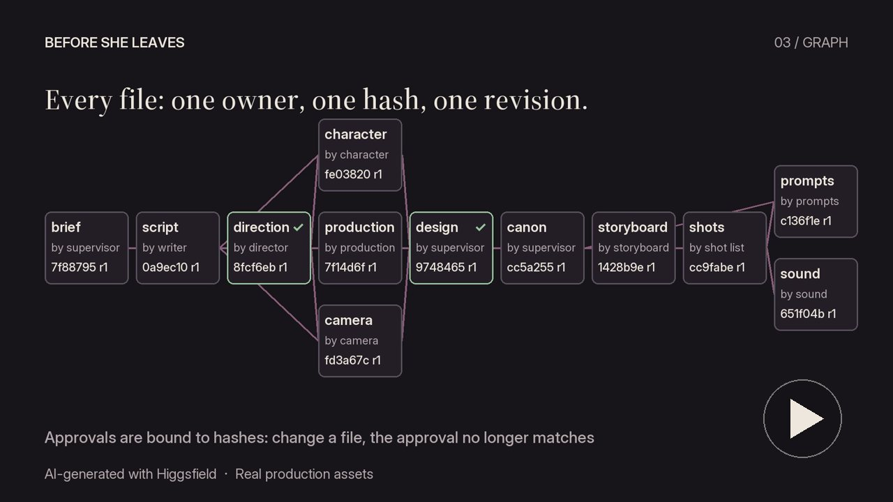

# vision_art_creator

[English](README.md) · [中文](README.zh.md) · [Español](README.es.md) · [हिन्दी](README.hi.md) · [العربية](README.ar.md) · **Português (BR)** · [Türkçe](README.tr.md) · [Français](README.fr.md) · [Deutsch](README.de.md) · [Русский](README.ru.md) · [日本語](README.ja.md) · [한국어](README.ko.md)

> Um pacote de skills de produção cinematográfica com IA para o [Claude Code](https://claude.com/claude-code) e o [OpenAI Codex](https://github.com/openai/codex).

O `vision_art_creator` reúne **11 skills `creator-*`** que cobrem todos os
departamentos de uma produção cinematográfica — do roteiro até o corte final —
em um único repositório. Instale em qualquer máquina com `git clone` +
`./install.sh`.

> As skills foram projetadas para referenciar umas às outras
> (o `creator-pipeline-supervisor` orquestra as demais). Recomenda-se
> instalá-las todas juntas.

---

## Demo: *Before She Leaves*

Uma cena de 26 segundos produzida com este pacote e o Higgsfield (referências Nano Banana Pro, clipes Seedance 2.0), e um making-of de 30 segundos que mostra o grafo registrado: responsáveis, hashes e aprovações. Dois agentes, Claude Code e OpenAI Codex, trabalharam com os mesmos arquivos de skills. Todas as imagens foram geradas por IA.

| Filme (26 s) | Making-of (30 s) |
|---|---|
| [](https://github.com/ilkaydemiralay/vision_art_creator/releases/download/v1.2.0/before-she-leaves-film.mp4) | [](https://github.com/ilkaydemiralay/vision_art_creator/releases/download/v1.2.0/before-she-leaves-making-of.mp4) |

---

## Instalação

```bash
git clone https://github.com/ilkaydemiralay/vision_art_creator.git ~/projects/vision_art_creator
cd ~/projects/vision_art_creator
./install.sh
```

Usa o OpenAI Codex? Instale no diretório de skills dele e reinicie o Codex:

```bash
./install.sh --codex   # ~/.agents/skills/
```

O `install.sh` cria um **symlink** para cada skill em
`~/.claude/skills/<skill-name>` que aponta de volta para este repositório. A
vantagem: para atualizar, basta um simples `git pull` — sem reinstalação.

### Opções

```bash
./install.sh --target /path/to/skills   # instala em um diretório de skills diferente
./install.sh --force                    # sobrescreve nomes existentes
./uninstall.sh                          # remove os symlinks
```

O `uninstall.sh` remove apenas os symlinks que apontam para este repositório —
ele deixa intactos links externos e diretórios reais (a menos que use
`--force`).

### Verificação

Após instalar, reinicie o Claude Code e digite:

```
/creator-pipeline-supervisor
```

Confira se todas as 11 skills `creator-*` aparecem na lista de skills.

---

## O que há no pacote

| Skill | Resumo |
|---|---|
| `creator-pipeline-supervisor` | Orquestra toda a produção, sequencia os departamentos, garante a continuidade, executa o QC e produz o relatório de prontidão para entrega. |
| `creator-director` | Traduz o roteiro em uma visão de direção unificada: direção de cena, atuação, blocking, controle de tom. |
| `creator-screenwriter` | Escrita e revisão de roteiros, tratamentos, loglines, escaletas de cena e diálogos. |
| `creator-character-designer` | Projeta o personagem como um todo integrado: psicologia, biografia, identidade visual, figurino, props, expressões codificadas em FACS. |
| `creator-production-designer` | Constrói o mundo do filme: locações, sets, props, atmosfera de época, linguagem de cor/material, âncoras de continuidade. |
| `creator-cinematographer` | Projeta a linguagem visual: luz, câmera, lente, enquadramento, cor, atmosfera, movimento. |
| `creator-storyboard-artist` | Visualiza as cenas painel a painel: escalas de plano, ângulos, blocking, composição, prompts de IA. |
| `creator-shot-list-designer` | Transforma cenas e storyboards em uma shot list técnica, dividida em blocos produzíveis por IA. |
| `creator-sound-music-designer` | O mundo sonoro do filme: atmosfera, foley, SFX, trilha, leitmotifs, plano musical cena a cena, prompts de áudio para IA. |
| `creator-prompt-engineer` | Converte a saída de cada departamento em prompts consistentes para GPT Image 2.0, Nano Banana, Sora, Veo, Runway, Kling, Higgsfield e outros. |
| `creator-final-cut-editor` | Monta shots/áudio/música/gráficos gerados por IA em um filme acabado: rough/fine/final cut, triagem de erros de IA, formatos de entrega. |

A definição completa de cada skill está em seu próprio arquivo `SKILL.md`.

---

## Como funciona

O pacote opera sobre um **estado compartilhado baseado em sistema de arquivos**.
Todas as skills leem e escrevem em uma árvore `project/` comum (`bible/`,
`screenplay/`, `characters/`, `storyboards/`, `prompts/`, `cuts/`, `qc/`, …). O
`creator-pipeline-supervisor` mantém os arquivos canônicos (as "bíblias" do
projeto e de continuidade) e audita a saída de cada departamento em relação a
eles.

O pipeline canônico:

```
0. project bible & vision
1. creator-screenwriter        → screenplay
2. creator-director            → vision, direction sheets, arcs
3-4-5. creator-character-designer + creator-production-designer
        + creator-cinematographer        (run in parallel)
6. creator-storyboard-artist   → panels with prompts
7. creator-shot-list-designer  → shot list + edit plan
8. creator-prompt-engineer     → tool-fit image + video prompts
   → [AI material generation — operator]
9. creator-sound-music-designer → sound + score plan
10. creator-final-cut-editor   → rough → fine → final cut → delivery

Throughout: creator-pipeline-supervisor enforces continuity, runs QC,
manages revision loops, and holds the bibles.
```

A sequência é canônica, mas não rígida: o feedback do diretor pode reativar o
roteirista, e personagem/produção/cinematografia normalmente rodam em paralelo
assim que a visão de direção está definida.

---

## Modo de grafo registrado (opcional, experimental)

Desde a v1.1.0, o pacote inclui um fluxo de trabalho opcional e verificável por máquina para uma única cena. `creator-pipeline-supervisor` pode executar a pré-produção como um grafo de 12 nós: cada artefato é registrado com seu hash SHA-256, cada aprovação fica vinculada às entradas exatas que revisou e uma revisão reexecuta apenas os nós afetados.

- Fluxo: `workflows/single-scene.v1.json`. Contrato: `skills/creator-pipeline-supervisor/references/graph-workflow.md`.
- Schemas JSON em `schemas/`, um validador somente leitura em `scripts/validate_graph.py` e testes em `tests/`.
- Um piloto de texto completo de 15 segundos e três planos em `examples/single-scene/`: v00 para em um conflito de design, v01 o resolve e v02 muda a cor de um objeto de cena.

O uso normal das skills não exige Python. Para rodar o validador (Python 3.10+):

```bash
python3 -m venv .venv
.venv/bin/pip install -r requirements-graph.txt
.venv/bin/python -m unittest discover -s tests
.venv/bin/python scripts/validate_graph.py validate --manifest path/to/manifest.json
```

Limites: é um piloto apenas de texto, escrito por um único autor. Departamentos em paralelo, geração de mídia, edição e custos não foram testados. A identidade de quem aprova e os carimbos de data/hora são declarados pelo operador, não assinados. As notas de design e resultados estão em `docs/` (em turco).

---

## Atualização

```bash
cd ~/projects/vision_art_creator
git pull
```

Como as skills são vinculadas por symlink, nenhum passo adicional é necessário.

Veja o [CHANGELOG.md](CHANGELOG.md) para saber o que mudou em cada versão. **v1.1.0:** `creator-cinematographer` e `creator-storyboard-artist` agora mantêm os rascunhos de prompts nas próprias pastas; só `creator-prompt-engineer` escreve os prompts finais em `project/prompts/`.

---

## Desenvolvimento

1. Edite uma skill no repositório (`skills/creator-*/SKILL.md`).
2. Teste a alteração no Claude Code — como é um symlink, ela entra em vigor
   imediatamente.
3. Faça commit + push.

Para adicionar uma nova skill creator:

```bash
mkdir -p skills/creator-new-skill
# write SKILL.md and README.md
./install.sh   # create the symlink for the new skill
```

---

## Traduções

Este README e o `README.md` de cada skill estão disponíveis em 12 idiomas (veja
o seletor de idioma no topo). Os arquivos de instrução `SKILL.md` são mantidos
em inglês de propósito — o Claude responde no idioma do usuário em tempo de
execução, e um único conjunto canônico de instruções evita nomes de skill
duplicados.

---

## Licença

[MIT](LICENSE) © 2026 İlkay Demiralay.
